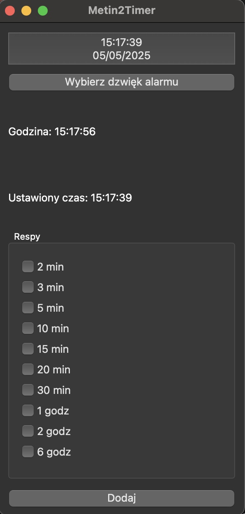

# Metin2Timer

A simple timer application built to track metin/boss spawn times.

## Features

- Customizable timer duration.
- User-friendly interface.
- Custom sound support

## Contributing

Contributions are welcome! Please follow these steps:

1. Fork the repository.
2. Create a new branch:
    ```bash
    git checkout -b feature-name
    ```
3. Commit your changes:
    ```bash
    git commit -m "Add feature-name"
    ```
4. Push to your branch:
    ```bash
    git push origin feature-name
    ```
5. Open a pull request.




